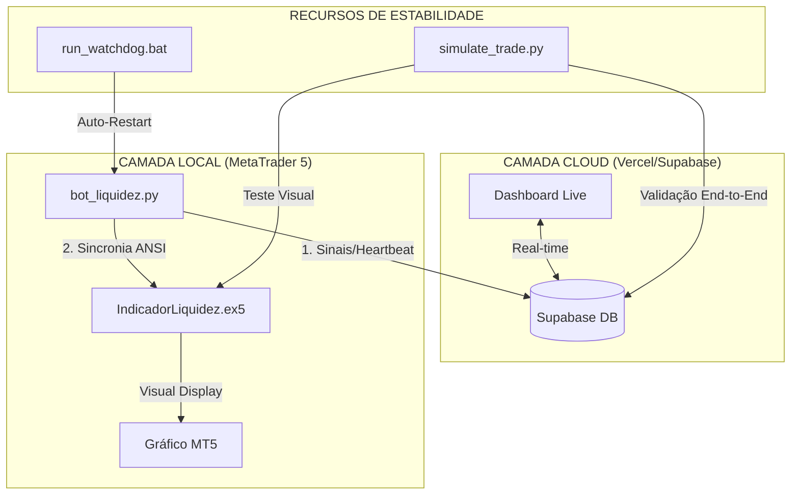

# 🏗️ Manual Mestre: Squad Trade-Liquidez-Python v3.5 Stable

Este ecossistema foi projetado para transformar a estratégia de **Liquidez de Pavio** em uma operação institucional automatizada, resiliente e autogerenciada por IA, agora integrada a uma interface de comando global.

---

## ⚖️ 1. Arquitetura AIOX (Unified Fullstack)

O sistema opera em uma estrutura de duas camadas integradas pelo Supabase:

1.  **Command Center (Frontend):** Localizado em `/app`, construído com Next.js 15.1.11 (Secure) e Tailwind CSS. Monitoramento global em [https://trade-two-smoky.vercel.app](https://trade-two-smoky.vercel.app).
2.  **Trading Agents (Python):** Localizado em `/squads/trade-liquidez-python`, executa a lógica quantitativa e se comunica com o MetaTrader 5 via Ponte de Sincronia Robusta.

### 🏛️ Diagrama de Orquestração v3.5


---

## 🗺️ 2. Mapeamento do Arquipélago (Estrutura de Arquivos)

| Pasta / Arquivo | Função Principal |
|---|---|
| 📂 **Raiz do Projeto** | |
| 📁 `app/` | Código fonte do Dashboard Web (Next.js). |
| 📄 `FULL_START.bat` | Inicializador mestre que liga o Dashboard Local e o Robô. |
| 📂 **squads/trade-liquidez-python/** | |
| 📁 `scripts/` | Motores operacionais (Python). |
| 📄 `bot_liquidez.py` | Execuão real das ordens e gestão de ciclos. |
| 📄 `simulate_trade.py` | **Hub de Testes.** Valida simultaneamente a Nuvem e o MT5. |
| 📄 `IndicadorLiquidez.mq5` | **Ponte Blindada.** Agora com suporte a `FILE_SHARE_READ` e ANSI. |
| 📄 `config.yaml` | Parâmetros de risco e filtros quantitativos. |

---

## 🚀 3. Motores de Performance (Avançado)

### 🧩 A. Sincronia Visual "Blindada" (MT5 Bridge)
O `IndicadorLiquidez.mq5` foi refatorado para ser imune a conflitos de leitura. 
- **Robustez:** Utiliza abertura compartilhada, permitindo que o robô escreva enquanto o indicador lê, eliminando o erro de "arquivo em uso".
- **Formato:** Codificação ANSI purista para compatibilidade total com o terminal Windows.

### 🧬 B. Dashboard de Vigilância (Vercel)
O Dashboard em [trade-two-smoky.vercel.app](https://trade-two-smoky.vercel.app) oferece:
- **Monitor de Heartbeat:** Confirmação em tempo real que o robô local está "respirando".
- **Sala de Guerra Agêntica:** Consenso em tempo real entre personas (Simons, Druckenmiller, Taleb) antes da execução de sinais.

---

## 🛠️ 4. Guia de Operação Estabilizada

### 🚦 Como Rodar um Teste de Ponta a Ponta
Para garantir que tudo está ok antes da sessão:
1.  Abra o MetaTrader 5 e carregue o `IndicadorLiquidez` (Certifique-se de compilar com **F7** no MetaEditor).
2.  No terminal, execute:
    ```bash
    python scripts/simulate_trade.py
    ```
3.  **Verifique:** O Dashboard deve piscar "SIGNAL" e o MT5 deve desenhar as zonas e setas instantaneamente.

### ⚙️ Produção Real-Time
1.  Use o **`FULL_START.bat`** na raiz para ligar o sistema completo.
2.  Monitore logs via console e a performance via deploy na Vercel.

---

## 🧠 5. Configuração de Segurança Cloud

O frontend foi estabilizado contra vulnerabilidades críticas:
*   **Next.js:** Mantido em v15.1.11+.
*   **Vercel Settings:** Framework Preset fixado em **Next.js** para roteamento dinâmico.

---
*Manual Mestre v3.5 Stable - Synkra AIOX Ecosystem*
