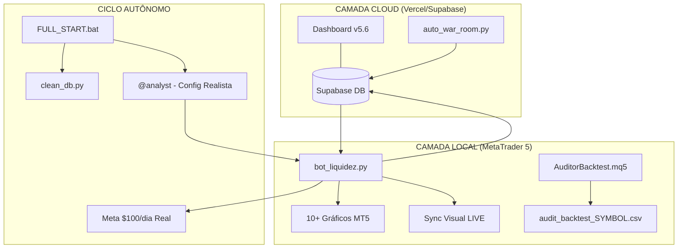

# 🏗️ Manual Mestre: Squad Trade-Liquidez-Python v5.6 Auditor Edition

Este ecossistema atingiu o **Padrão Ouro de Trading Algorítmico**. A estratégia de **Liquidez de Pavio** agora é global, operando em múltiplos ativos com realismo financeiro absoluto (spreads/pip-value) e auditoria visual completa de cada trade no MetaTrader 5.

---

## ⚖️ 1. Arquitetura de Governança AIOX

O sistema opera em um ciclo fechado de inteligência multi-ativo e visualização de alta fidelidade:

1.  **Command Center (Frontend):** Monitoramento global com P&L absoluto sincronizado pelo tempo de sessão.
2.  **Trading Engine (Python):** Execução técnica Multi-Pair com recálculo dinâmico de alvos (1.5x) e auto-filling (FOK).
3.  **Visual Audit (MT5):** Scripts dedicados para validar visualmente o racional de cada entrada e saída do passado.

### 🏛️ Diagrama de Orquestração v5.6

---

## 🗺️ 2. Mapeamento do Arquipélago (Scripts Críticos)

| Pasta / Arquivo | Função Principal |
|---|---|
| 📄 `FULL_START.bat` | **Orquestrador v4.1.** Boot blindado com limpeza automática e escape de caracteres P&L. |
| 📄 `bot_liquidez.py` | **Motor v5.6.** Monitoramento de 10 pares, IFR, Tendência e P&L absoluto de sessão. |
| 📄 `market_replay.py` | **Simulator v5.6.** Backtest realista com spread, pip-value e exportação de caminhos. |
| 📄 `AuditorBacktest.mq5`| **Script de Auditoria.** Desenha setas, zonas e linhas ligando entrada à saída. |
| 📄 `LimparGrafico.mq5` | **Faxina Visual.** Remove todos os objetos de auditoria e sinais com um clique. |

---

## 🚀 3. Motores de Performance (Avançado)

### 🧠 A. Filtro Sniper & Realismo
- **Confluência:** Zonas M15 + IFR (60/40) + Média Móvel 20 H1.
- **Custos Reais:** Backtests agora descontam spread (1.5 - 2.5 pips) e corrigem o valor do ponto (JPY).
- **P&L Inquebrável:** O lucro da sessão é calculado por timestamp absoluto, imune a viradas de meia-noite.

### ⚡ B. Auditoria Visual v3.0
Diferente da versão anterior, agora você vê:
*   **Path Tracking:** Uma linha ligando o ponto exato da entrada ao ponto de saída.
*   **Color Coding:** Linha Verde (Lucro) / Linha Vermelha (Prejuízo).
*   **Racional Tooltip:** Passe o mouse para ver o PNL, RSI e Trend daquele trade específico.

---

## 🛠️ 4. Guia de Operação Autônoma

1.  Abra os 10 pares no MT5.
2.  Execute o **`FULL_START.bat`**.
3.  Para validar o passado: rode o `market_replay.py` e arraste o `AuditorBacktest` para o gráfico.
4.  Para operar o presente: mantenha o `IndicadorLiquidez` em cada gráfico.

---
*Manual Mestre v5.6 Auditor Edition - Synkra AIOX Ecosystem*
