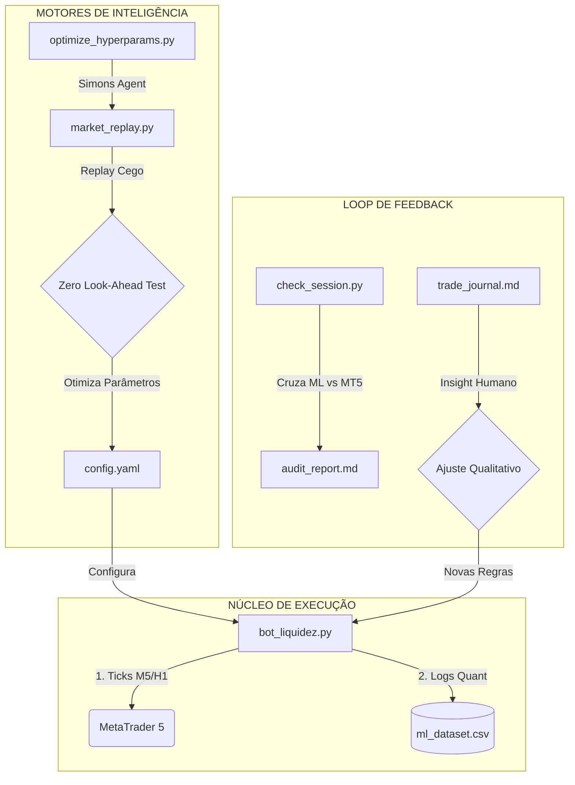

# 🏗️ Manual Mestre: Squad Trade-Liquidez-Python v2.0

Este ecossistema foi projetado para transformar a estratégia de **Liquidez de Pavio** em uma operação institucional automatizada, resiliente e autogerenciada por IA.

---

## ⚖️ 1. Arquitetura do Squad e Loop de Inteligência

O sistema não opera por "regras fixas", mas sim através de um loop contínuo de **Execução, Auditoria e Re-Calibração**.

### 🏛️ Diagrama de Orquestração

---

## 🗺️ 2. Mapeamento do Arquipélago (Estrutura de Arquivos)

| Pasta / Arquivo | Função Principal |
|---|---|
| 📂 **Raiz** | |
| 📄 `config.yaml` | **Única fonte da verdade.** Centraliza todos os parâmetros de risco e gatilho. |
| 📄 `run_watchdog.bat` | **Escudo de Execução.** Mantém o robô respirando mesmo em quedas de sistema/MT5. |
| 📂 `scripts/` | |
| 📄 `bot_liquidez.py` | O coração operacional. Executa as ordens LIMIT em tempo real. |
| 📄 `market_replay.py` | Motor de simulação cega (Walk-Forward) para validação realística. |
| 📄 `optimize_hyperparams.py` | Otimizador agêntico (Busca em Grade Aleatória) para auto-calibração. |
| 📄 `check_session.py` | Auditor quantitativo de fim de dia (ML vs Resultados). |
| 📄 `IndicadorLiquidez.mq5` | Ponte visual. Indicador que desenha zonas e sinais no seu MT5. |
| 📂 `docs/` | |
| 📄 `trade_journal.md` | Onde você registra insights qualitativos para o sistema aprender. |
| 📄 `README_SQUAD.md` | Este manual. |
| 📂 `data/` | |
| 📄 `ml_dataset.csv` | Dataset bruto com os atributos (DNA) de cada gatilho visto. |
| 📂 `agents/` | Definições de persona (Filosofias de Simons, Tudor Jones, Taleb). |

---

## 🚀 3. Motores de Performance (Deep Dive)

### 🧩 A. O Motor de Replay (Zero Look-Ahead Bias)
Localizado em `market_replay.py`, este motor resolve o problema do robô "trapalcear" vendo o futuro. Ele baixa fatias do histórico e avança o tempo minuto a minuto, entregando ao robô apenas o que ele saberia naquele exato segundo. Se o robô lucra aqui, ele lucra na vida real.

### 🧬 B. O Agente Otimizador (Jim Simons)
Em `optimize_hyperparams.py`, o sistema assume a persona do Quant Jim Simons. Ele testa centenas de combinações de `Retracement`, `Cooldown` e `TimeExits` no Replay, encontrando matematicamente o setup que rende mais PNL para a volatilidade da semana atual e atualizando o `config.yaml` sozinho.

### 🎨 C. Visualização em Tempo Real (Indicador)
O `IndicadorLiquidez.mq5` não é um script simples; ele é um indicador dinâmico.
- **Como Funciona:** O Python envia os dados para o MT5 via arquivo CSV -> O Indicador monitora o arquivo -> O gráfico se desenha sozinho.
- **Caminho de Instalação:** `MQL5/Indicators/IndicadorLiquidez.mq5`.

---

## 🧠 4. Pipeline de Aprendizado de Máquina (ML)

O robô está configurado para coletar **Features** (Atributos) em cada sinal:
*   `top_wick_pct` / `bottom_wick_pct`: Anatomia da rejeição.
*   `volume_momentum`: Força institucional no candle de sinal.
*   `distance_to_zone`: O quão próximo o fechamento ficou da liquidez.

**Uso Futuro:** Ao acumular > 1000 linhas de dados, poderemos ativar um agente de **Deep Learning** para filtrar quais trades o robô deve *ignorar* com base em probabilidade Bayesiana.

---

## 🛠️ 5. Guia de Operação Diária

### 📅 Início da Semana (Domingo/Segunda)
1.  Rode `/quant-optimize` (ou execute `python scripts/optimize_hyperparams.py`). Isso calibra o bot para a volatilidade fresca.
2.  Verifique se o `config.yaml` foi atualizado.

### 🚦 Operação Live
1.  Abra o MetaTrader 5 (Conta Demo).
2.  Inicie o **`run_watchdog.bat`**.
3.  Arraste o `IndicadorLiquidez` no gráfico M5.

### 🔚 Fechamento do Dia
1.  Rode `python scripts/check_session.py`.
2.  Compare o relatório gerado em `docs/audit_YYYY-MM-DD.md` com suas notas no `docs/trade_journal.md`.

---

## 🤖 6. Conversando com os Agentes

Você pode solicitar mudanças de comportamento diretamente no chat:

*   **Para Jim Simons (Quant):** *"Aumente as iterações de otimização para testar o pavio entre 20% e 80%."*
*   **Para Nassim Taleb (Risco):** *"Mova o Break-even para o 2º candle e adicione um Stop fixo de 200 pontos de emergência."*
*   **Para Paul Tudor Jones (Execução):** *"Altere o lote da estratégia para 2.0 e mude o tempo de saída para 10 candles."*

---
*Manual Mestre v2.0 - Squad Trade-Liquidez*
