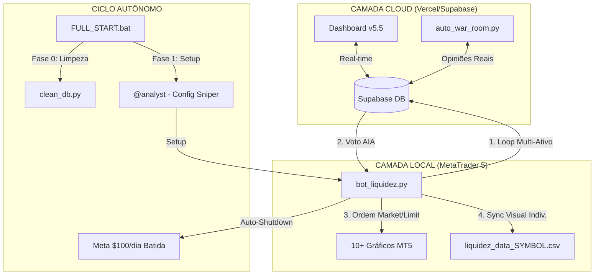

# 🏗️ Manual Mestre: Squad Trade-Liquidez-Python v5.5 Multi-Pair Sniper

Este ecossistema evoluiu para uma **Operação de Trading de Elite**. A estratégia de **Liquidez de Pavio** agora é global, monitorando os 10 pares mais líquidos do mercado simultaneamente no timeframe de **M15**, com execução ultra-veloz e governança agêntica total.

---

## ⚖️ 1. Arquitetura de Governança AIOX

O sistema opera em um ciclo fechado de inteligência multi-ativo e visualização em tempo real:

1.  **Command Center (Frontend):** Monitoramento global consolidado em [trade-two-smoky.vercel.app](https://trade-two-smoky.vercel.app).
2.  **Trading Engine (Python):** Execução técnica Multi-Pair (MARKET/LIMIT) com reporte de P&L real via histórico de deals do MT5.
3.  **War Room (AIOX Agents):** Camada de decisão que gera opiniões estruturadas por ativo e valida sinais via Supabase.

### 🏛️ Diagrama de Orquestração v5.5

---

## 🗺️ 2. Mapeamento do Arquipélago (Estrutura de Arquivos)

| Pasta / Arquivo | Função Principal |
|---|---|
| 📂 **Raiz do Projeto** | |
| 📄 `FULL_START.bat` | **Orquestrador v4.1.** Boot blindado de todos os módulos com limpeza automática. |
| 📂 **squads/trade-liquidez-python/scripts/** | |
| 📄 `bot_liquidez.py` | **Motor Mestre v5.5.** Monitoramento simultâneo de 10 pares e alvos dinâmicos. |
| 📄 `market_replay.py` | **Simulator Turbo.** Backtest ultra-veloz com suporte a M15 e Multi-Ativo. |
| 📄 `IndicadorLiquidez.mq5`| **Ponte Visual v5.5.** Detecção automática de par e desenho de zonas específicas. |
| 📄 `audit_full.py` | **Auditoria.** Rastreamento profundo de ordens no histórico do MT5. |
| 📄 `config.yaml` | **Cérebro Estratégico.** Configurações Sniper (RSI, Tendência, Símbolos). |

---

## 🚀 3. Motores de Performance (Avançado)

### 🧠 A. Filtro Sniper v5.5
O robô agora exige confluência tripla para agir:
1.  **Zonas M15:** Identificação de liquidez em tempos gráficos rápidos para maior volume.
2.  **IFR (RSI) Exausto:** Confirmação de sobrevenda (45) ou sobrecompra (55).
3.  **Tendência H1:** Só opera a favor da Média Móvel de 20 períodos em 1 hora.

### ⚡ B. Execução de Alta Fidelidade
- **Modo MARKET:** Entra instantaneamente no fechamento do sinal.
- **Auto-Filling:** Tenta automaticamente modos FOK/IOC para garantir a entrada na corretora (Erro 10030 corrigido).
- **P&L Real:** O lucro exibido no Dashboard é extraído diretamente dos *Deals* do MT5, garantindo 100% de paridade com o saldo da conta.

---

## 🛠️ 4. Guia de Operação Autônoma

### 🚦 Iniciando a Sessão
1.  Abra os 10 pares recomendados no seu MT5.
2.  Rode o **`FULL_START.bat`**.
3.  O sistema assumirá o controle, buscando a meta de **$100/dia** através do volume multi-ativo.

### 📊 Monitoramento
Acompanhe o P&L Global no Painel Ao Vivo. Se um par como o `GBPUSD` entrar, ele aparecerá instantaneamente no topo da lista com o rótulo **VALIDADO**.

---

## 🧠 5. Configuração Dinâmica (`config.yaml`)

*   `symbols`: Lista de ativos monitorados.
*   `rsi_overbought / oversold`: Ajuste de sensibilidade de exaustão.
*   `use_trend_filter`: Habilita/Desabilita a trava macro H1.

---
*Manual Mestre v5.5 Multi-Pair Sniper - Synkra AIOX Ecosystem*
